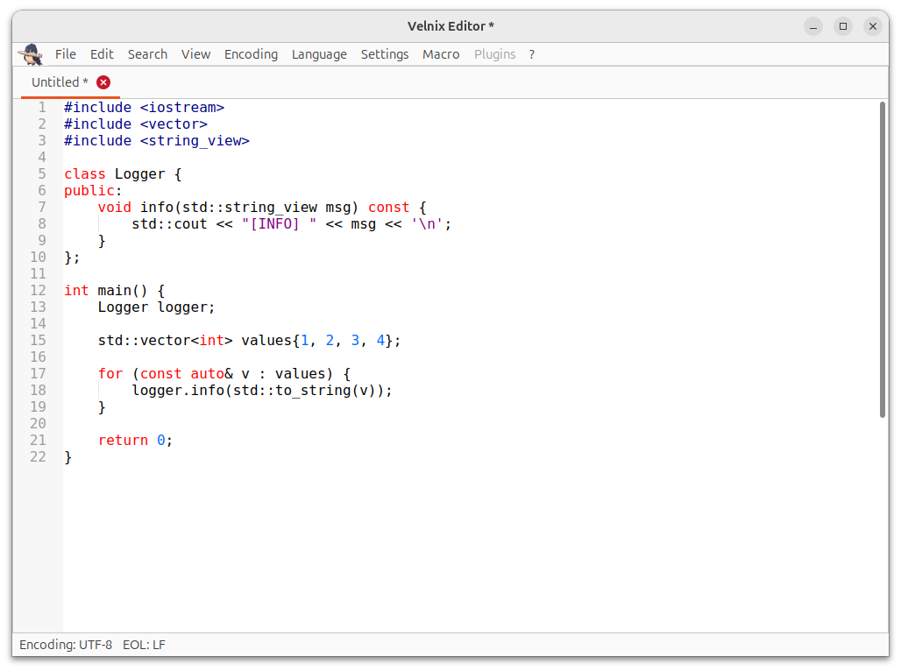
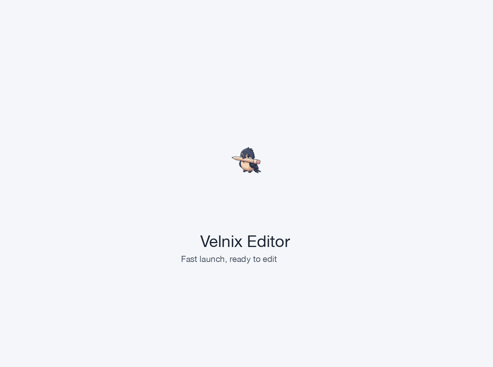
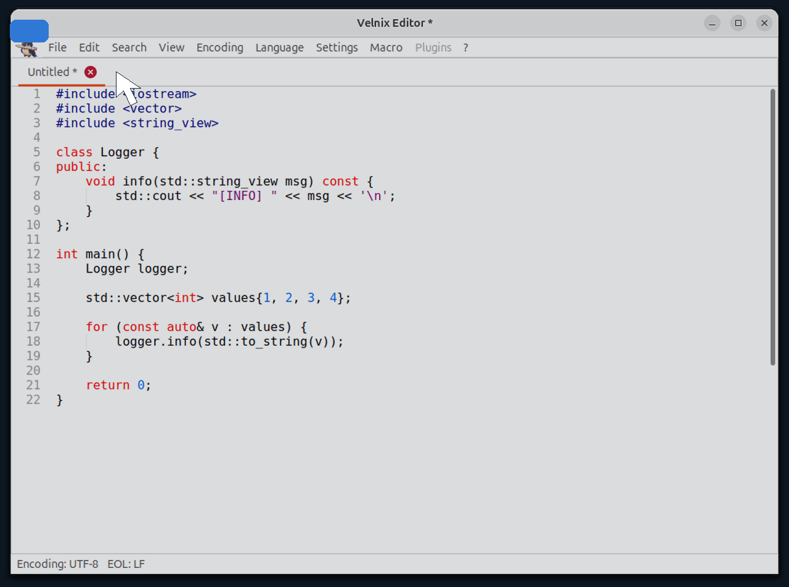
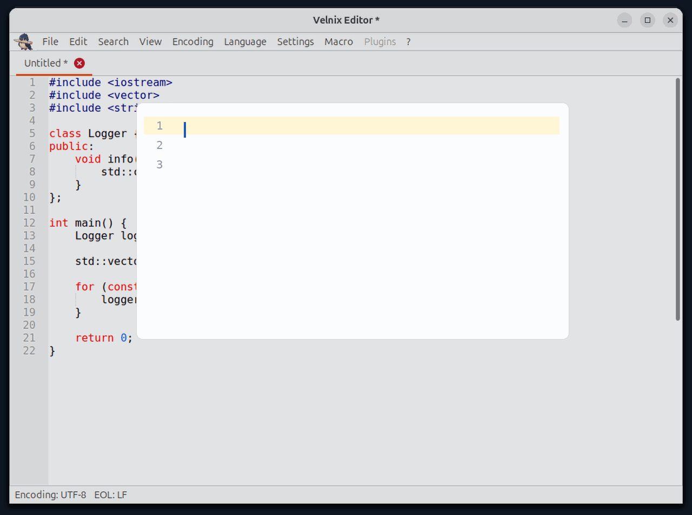
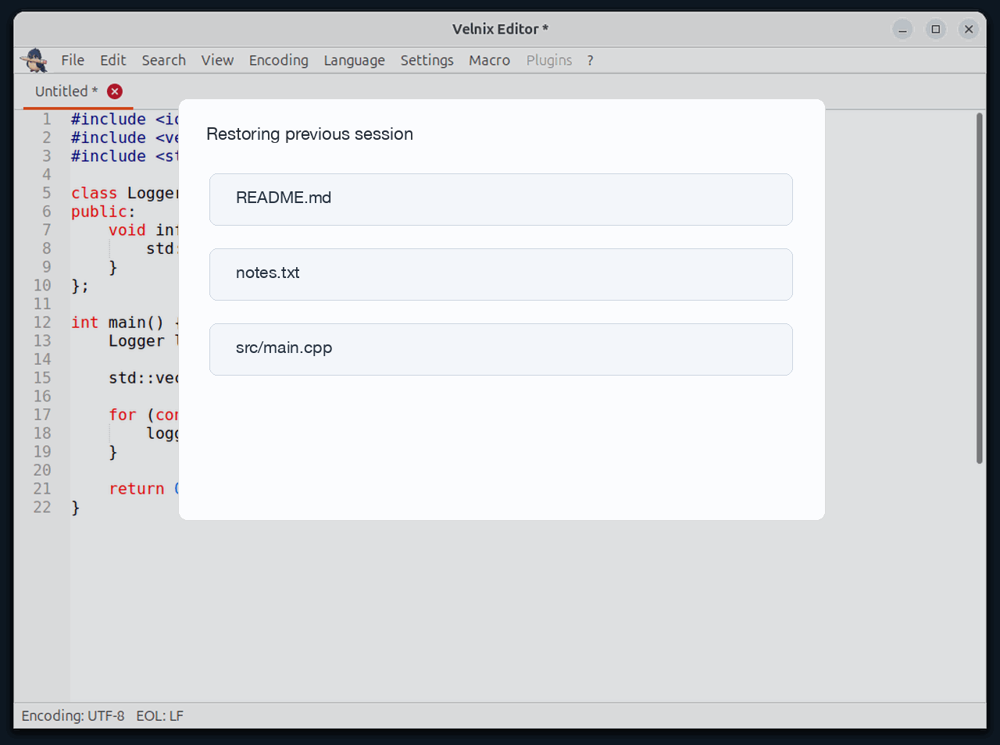
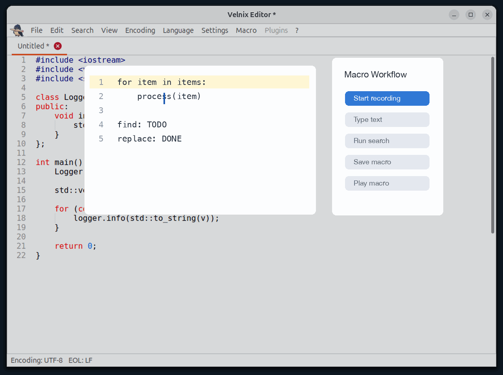
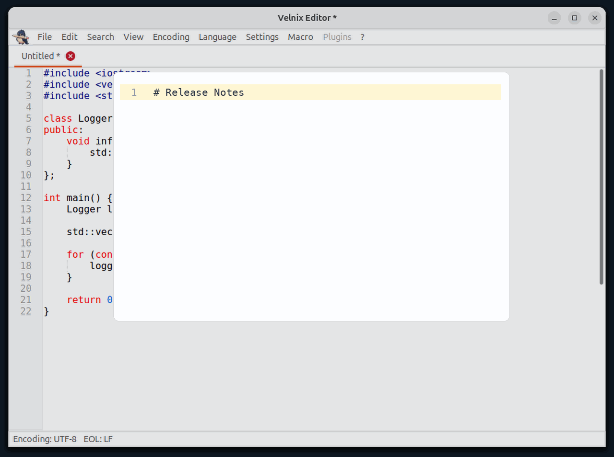

# Velnix Editor

Fast. Native. Practical.

Velnix Editor is a lightweight native text editor for Linux developers. It is made for people who want a quick, flexible, and capable editor for everyday text
and source-code work.

Built with GTK, Scintilla, and Lexilla, Velnix Editor focuses on direct, efficient editing workflows in a clean native desktop application.

Planned first public release: **0.1.0**.

## Screenshot



## Feature Demos

Current demos focus on implemented editing workflows in the 0.1.0 foundation.

### Fast Startup



### Opening Files



### Editing Basics



### Session Restore



### Macro Recording and Playback



### Markdown Syntax Highlighting



## Features

- Native GTK interface with fast startup and low overhead
- Multi-tab editing for text and source files
- Find and replace, syntax highlighting, selected-keyword occurrence
  highlighting, and macro recording/playback
- Encoding detection and conversion for common UTF and ANSI workflows
- Preferences, shortcuts, recent files, and external-change prompts

## Philosophy

Velnix Editor is not trying to become a heavy IDE. It is focused on the daily
editing loop: open quickly, edit comfortably, search confidently, save safely,
and stay out of the way.

The first release starts with a solid native editor foundation. Future versions
can grow into themes, drag-and-drop workflows, and plugins, but the center of
the project should remain simple: practical power without unnecessary weight.

## Why Velnix?

Many Linux text editors are either minimal utilities or full IDEs.
Velnix Editor aims to stay in the middle ground:

- lightweight but capable
- native but modern
- practical without unnecessary complexity

## Try It From Source

```bash
cmake -S . -B build -DCMAKE_BUILD_TYPE=Release
cmake --build build -j4
./build/VelnixEditor/velnix-editor
```

The executable is generated under `build/VelnixEditor/`.

## Package

Build a local Debian package:

```bash
./scripts/build-deb.sh
```

The generated package is written to `dist/`.

## Runtime Data

User configuration is stored under `~/.config/velnix-editor/` by default.

## Developer Documentation

- [Project Overview](README_PROJECT.md)
- [Installation and Packaging](docs/INSTALL.md)
- [Testing](docs/TESTING.md)
- [Encoding Behavior](docs/ENCODING.md)
- [Known Limitations](docs/KNOWN_ISSUES.md)
- [Third-Party Notices](docs/THIRD_PARTY_NOTICES.md)
- [Release Checklist](docs/RELEASE_CHECKLIST.md)
- [Release Notes 0.1.0](docs/RELEASE_NOTES_0.1.0.md) - historical release snapshot
- [Roadmap](docs/ROADMAP.md)

## License

Velnix Editor is distributed under the GNU General Public License version 3.
See [LICENSE](LICENSE) and [Third-Party Notices](docs/THIRD_PARTY_NOTICES.md)
for details.

The Velnix Editor name, logo, and application icon are protected project brand
assets. See [TRADEMARKS.md](TRADEMARKS.md) for permitted use.
